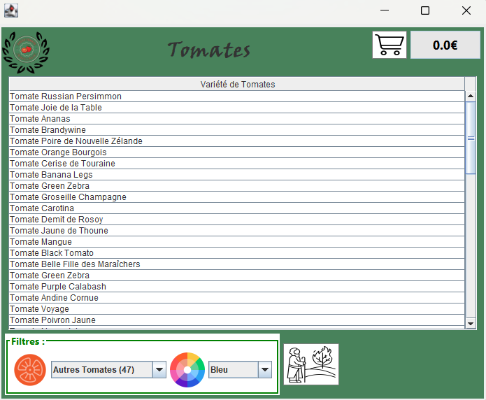

# Application Magasin de Tomates (SAE S2.01)



Ce projet est une application de gestion de vente de tomates développée en **Java** dans le cadre de la SAE S2.01 (Développement d'une application).

Elle propose une interface graphique réalisée avec **WindowBuilder** (Swing) permettant aux utilisateurs de parcourir un catalogue de tomates, de gérer un panier et de passer commande.

## 📂 Structure du Projet

Le projet suit l'architecture standard **Maven** :

* **`src/main/java/`** : Code source de l'application.
    * **`ihm/`** : Classes de l'interface graphique (Fenêtres, Dialogues, Pages). Le point d'entrée semble être `Tomato.java`.
    * **`modèle/`** : Classes métier (Tomate, Panier, Client, Facture...).
* **`src/main/resources/`** : Ressources statiques.
    * **`images/`** : Photos des tomates et icônes de l'interface.
    * **`data/`** : Fichiers de persistance des données (`tomates.json`, `tomatesSauvegarde.json`).
* **`src/test/java/`** : Tests unitaires (ex: `TomatesTest.java`).
* **`pom.xml`** : Fichier de configuration Maven (dépendances, build).

## 🚀 Fonctionnalités

1.  **Catalogue Interactif** : Visualisation des variétés de tomates avec images et descriptions.
2.  **Filtrage** : Recherche par type ou couleur (cf. images de filtres dans les ressources).
3.  **Gestion du Panier** : Ajout et suppression d'articles (`PagePanier`).
4.  **Commande et Paiement** : Simulation du processus d'achat (`PagePaiements`, `Facture`).
5.  **Persistance** : Les données des tomates sont chargées et sauvegardées au format JSON.

## 🛠️ Prérequis

* **Java JDK** (version compatible avec votre `pom.xml`, probablement 8, 11 ou 17).
* **Maven** pour la gestion du projet.
* Un IDE comme **Eclipse** (recommandé car le projet contient des fichiers de configuration Eclipse) ou IntelliJ IDEA.

## ▶️ Installation et Exécution

### Via Eclipse

1.  Ouvrez Eclipse.
2.  Faites `File > Import > Maven > Existing Maven Projects`.
3.  Sélectionnez le dossier racine du projet.
4.  Localisez la classe principale dans `src/main/java/ihm/Tomato.java` (ou `main.java`, selon votre structure exacte).
5.  Faites un clic droit dessus > `Run As > Java Application`.

### Via Ligne de Commande (Maven)

Pour compiler et lancer les tests :
```bash
mvn clean install